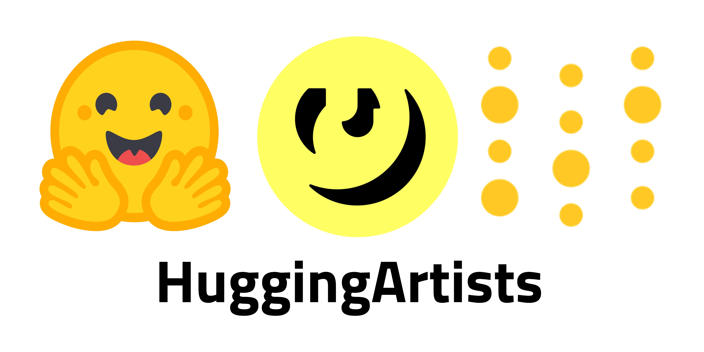
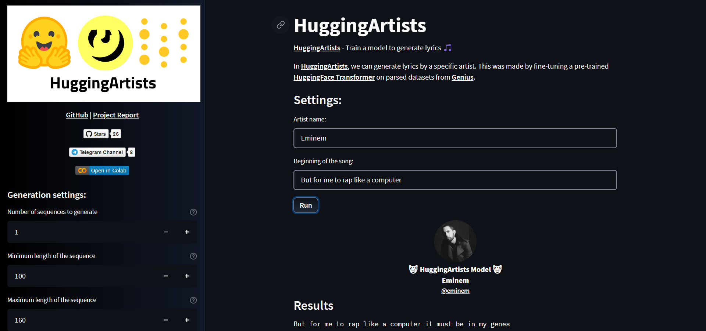

# HuggingArtists - Train a model to generate lyrics

## Create AI-Artist in just 5 minutes!

### [🚀 Run the demo notebook to train](https://colab.research.google.com/github/AlekseyKorshuk/huggingartists/blob/master/huggingartists-demo.ipynb)
### [🚀 Run the GUI demo to test](https://huggingface.co/spaces/AlekseyKorshuk/huggingartists)

_Disclaimer: this project is not to be used to publish any false generated information or unpleasant words but to perform research on Natural Language Generation._

## How to use

Just to generate without training, use [Spaces with Streamlit](https://huggingface.co/spaces/AlekseyKorshuk/huggingartists).

To train with the demo, click on below link and share your results!

You can also use it locally by installing the dependencies with `pipenv` or `pip` and use [`huggingartists-demo.ipynb`](huggingartists-demo.ipynb)

## Results

There are some interesting lyrics. Contact me to add your results:

#### Eminem:
~~~
I am a bit of a nutter
Like a fucking crazy nut
But I just wanted to break and get a little more serious, so be patient
I dont think I need no medical attention
But I do know that these niggas gonna be in my prayers
And they say Im a nutter
Like a fucking crazy nut
But I love you
I am a nutter
Like a fuckin nutter
But I feel like the greatest that I can be
With your body and your spirits
But I dont know how I will act
When I finally get out
And I get pissed off
Ill be right back at ya with the first one on the floor
But I aint ever gonna get the respect youve been getting
And Im a nutter...
~~~
~~~
I am bipolar while I’m rhyming, bipolar while I am hate
When I’m rhyming, I may seem a little bit crazy
But the thing’s with these rhymes that I pick
I stick to the syllable ç unless it’s on a syllable
Bread is full of charmin I am thinkin all of the garbage
Hear the bass line and ya hear the bass line
But hip hop is what makes’em songs
I try to describe how I’m gettin’ em all, but I’m lazy
When I’m rapin on a song, I’m just making it
If I don’t got the right, In my mind...
~~~

#### Drake:
~~~
I am never livin the life that I never lived
I walk around with my Glock 9
And lay down with my feet up
This is my house, bitch
Welcome to Detroit, this is my city
Ive made it all my people proud
I even sold my house down
To get a possible placement as a burnt pit
My little girl, she should ntroller
Wanna flip sometimes on the upside
But its hard to hold a grudge, I dont bite
I say my wholehearted, prayer is my heart
I pray for you when Im gone, but I gotta leave you in peace
That we did not plan to be seeing each other, well
We did plan to be seeing each other, well
And if you ever need anything, I...
~~~

## Check existing:
* [Models](https://huggingface.co/models?filter=huggingartists)
* [Datasets](https://huggingface.co/datasets?search=huggingartists)

## Features:
* Generate lyrics by a specific artist
* Automatically upload models and datasets to [HuggingFace Profile](https://huggingface.co/huggingartists) after each run
* Parse dataset once and use it next time without spending time
* Each next run by any person will resume training from last checkpoint
* Training and results are automatically logged into [W&B](https://docs.wandb.com) through the [HuggingFace integration](https://docs.wandb.com/huggingface)

## About

*Built by Aleksey Korshuk*

🚀 If you want to contribute to this project OR create something cool together — contact me: [link](https://github.com/AlekseyKorshuk)

Star this repository:

## Resources
* Inspired by [HuggingTweets](https://github.com/borisdayma/huggingtweets)
* [Explore the W&B report](https://wandb.ai/huggingartists/huggingartists/reportlist) to understand how the model works
* [HuggingFace and W&B integration documentation](https://docs.wandb.com/library/integrations/huggingface)

## Got questions about W&B?
If you have any questions about using W&B to track your model performance and predictions, please reach out to the [slack community](https://wb-forum.slack.com/signup#/).
